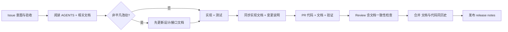

# Git 工作流 × 项目文档：通信设计

> 本文思考并设计「如何把 Git 工作流与项目文档结合起来」，让文档成为人×人、人×Agent、Agent×Agent 之间的共同通信协议，而不是仓库里的装饰品。

## 1. 为什么需要集成

Git 天然只能回答三个问题：**改了什么、谁改的、什么时候改的**。而「为什么这么改、系统怎么工作、约束是什么、怎么算完成」这些信息只能由文档承载。

不集成时的典型问题：

- **文档漂移**：代码改了，文档还是旧的，reviewer 和新成员被误导；
- **Agent 与人不一致**：Agent 只认代码不认文档，或文档太旧不敢信，各写各的；
- **Review 无据可依**：reviewer 只能猜作者的意图，无法对照设计文档验收；
- **信息重复**：同一规则在 README、设计文档、注释里各写一遍，改一处漏两处；
- **历史断链**：commit、PR、issue、文档彼此孤立，半年后无法回答「这个决定为什么这么做」。

目标：**一次变更 = 代码 + 文档 + 验证结果的完整单元**，三者同分支、同 PR、同评审、同历史。

## 2. 核心思想

1. **文档是通信协议，不是存档**：它的读者是「下一个改代码的人/Agent」，所以必须与代码同步演化；
2. **信息分层存放**：每类信息只放在它对应的层，不重复（单一事实来源）；
3. **文档先行（doc-first）**：非平凡改动先写清楚「为什么、接口长什么样」，再实现；
4. **文档是 review 的验收物**：文档不一致 = 变更不完整，不合并；
5. **git 提供统一历史**：代码和文档放在同一仓库，天然原子演化、可回溯。

## 3. 通信分层模型

| 层 | 载体 | 读者 | 回答的问题 | 更新时机 |
|----|------|------|------------|----------|
| 意图层 | Issue / 任务 / 验收标准 | 人 + Agent | 要做什么、怎么算完成 | 任务开始前 |
| 规则层 | AGENTS.md / CONTRIBUTING.md | Agent + 人 | 怎么协作、禁止什么、怎么验证 | 规则变化时（走 PR） |
| 知识层 | docs/（设计、实现、API） | 人 + Agent | 系统怎么工作、为什么这样设计 | 随对应代码变更 |
| 变更层 | commit / PR / review 评论 | 人 + Agent | 这次改了什么、验证了吗 | 每次变更 |
| 发布层 | changelog / release notes / tag | 用户、下游 | 新版本有什么、有什么破坏性变更 | 每次发布 |

规则：**信息向上不重复、向下可追溯**。例如「限流阈值」只写在配置文档；代码注释只写一行「见配置文档」；release notes 引用 changelog；changelog 从 commit 生成。

## 4. 集成机制

### 4.1 PR 是「联合变更单元」

每个 PR 必须回答：

- 改了哪个任务（关联 issue）；
- 代码改成什么样（diff）；
- 文档怎么同步（列出更新的文档路径，或明确声明「无需文档变更」并说明理由）；
- 验证证据（检查命令 + CI 结果）。

PR 模板里放一个「文档同步」字段（已在 [collaborative-workflow.md](collaborative-workflow.md) 的模板中落地）。行为、接口、配置变更如果没带文档变更，review 不通过就不合并。

### 4.2 文档先行（doc-first）

对非平凡功能：

```text
任务 → 先改设计/接口文档（写清意图与边界） → 实现按文档验收 → PR 同时包含文档 diff 与代码 diff
```

收益：

- 实现前暴露理解偏差，避免返工；
- reviewer 可以拿文档对照代码，而不是凭感觉；
- 多个 Agent 并行时，文档就是「当前共识」，避免基于旧假设开发。

### 4.3 单一事实来源

- 每类知识只写一处，其他位置用链接引用；
- 代码注释只写短「为什么」，长解释放文档，并指向文档（如 `/// 规则见 docs/design/config-spec.md`）；
- 文档不整段复制代码，示例可指向源文件；
- 配置项、端点、错误码、数据结构以文档为准，review 时对照核对。

### 4.4 commit 引用任务与文档

```text
feat: 新增限流配置 (#42)

- 实现滑动窗口限流
- 同步更新 docs/design/config-spec.md
```

这样 `git log`、`git blame`、PR 三者都能互相跳转。

### 4.5 Review 把文档当验收物

Review 清单中加入：

- [ ] 文档与代码一致（接口、配置、行为描述）
- [ ] 文档中的示例可运行
- [ ] 文档内链接有效
- [ ] 没有把同一信息复制到多个地方

### 4.6 自动化辅助（按团队阶段逐步启用）

| 手段 | 作用 | 建议时机 |
|------|------|----------|
| markdown 链接检查（CI） | 防止文档死链 | 文档规模变大后 |
| 源码变更时提示文档更新（PR 检查脚本） | 防止漏更新 | 团队稳定后 |
| 从 conventional commits 生成 changelog（如 git-cliff） | 发布层自动生成 | 有正式发布时 |
| 文档站点构建预览 | 让 review 看到渲染效果 | 文档成站点后 |

自动化是辅助，**不能替代 review 中的人工一致性检查**。

### 4.7 AGENTS.md 是 Agent 的「入职手册」

- Agent 开工前必读 AGENTS.md 与任务相关文档；
- AGENTS.md 本身的修改也要走 PR，让所有 Agent 通过阅读同一份文件保持一致；
- Agent 的 PR 描述中注明「依据的文档」，reviewer 可以检查 Agent 是否读对了上下文。

## 5. 落地方案（KeyGateway 示例）

### 5.1 变更 ↔ 文档映射矩阵

| 变更类型 | 必须同步的文档 |
|----------|----------------|
| 配置字段 / 格式 | [config-spec.md](../design/config-spec.md) |
| HTTP 端点 / 协议 / 错误码 | [endpoints.md](../api/endpoints.md)、[error-handling.md](../implementation/error-handling.md) |
| 路由 / 协议匹配 | [routing.md](../implementation/routing.md) |
| 认证 / KeyVault / 加密 | [authentication.md](../implementation/authentication.md)、[key-vault.md](../implementation/key-vault.md) |
| 审计字段 | [audit-logging.md](../implementation/audit-logging.md) |
| SSE / 流式转发 | [sse-streaming.md](../implementation/sse-streaming.md) |
| 新模块 / 架构变化 | [architecture.md](../design/architecture.md) + 对应实现文档 |
| 构建 / 命令 / 协作规则 | [AGENTS.md](../../AGENTS.md)、README |

### 5.2 已落地

- AGENTS.md 第 8 节已链接整套文档集；
- 协作工作流的 PR 模板已加入「文档同步」字段；
- Review 清单已加入文档一致性检查。

### 5.3 建议后续（可选）

- 在 docs/ 根目录加一份总索引 README；
- 每个文档头部标注「状态：生效 / 草稿 / 已废弃」与维护者；
- CI 增加 markdown 链接检查；
- 正式发布后启用 changelog 自动生成。

## 6. 推行步骤（渐进，不一步到位）

1. 规则写进 AGENTS.md（已完成）；
2. PR 模板加入「文档同步」字段（已完成）；
3. Review 清单加入文档一致性检查（已完成）；
4. 行为变更强制要求同步文档（从下一个 PR 开始执行）；
5. CI 增加链接检查（文档规模变大后）；
6. changelog 自动化（有正式发布后）；
7. 每次发布前做一次文档审计。

## 7. 收益与代价

### 收益

- Agent 开工速度快：一份可信文档 = 不需要反复问人；
- Review 有依据：对照文档验收，而不是凭感觉；
- 历史可追溯：commit → PR → 文档 → 任务互相跳转；
- 新人（或新 Agent）上手成本大幅降低；
- 文档漂移被 PR 关卡拦住，而不是事后补。

### 代价与控制

- 文档维护需要时间 → 通过「随变更同步 + 只写必要文档」控制，不为写而写；
- 模板与检查会增加 PR 负担 → 用 checklist 而非长篇大论；
- 文档先行会让小改动变慢 → 只对「非平凡、接口级、跨模块」改动启用 doc-first。

## 8. 一句话总结

把文档当成和代码同级的提交物：**一次 PR 一个完整变更单元，git 负责历史，文档负责语义，review 负责两者一致**。


